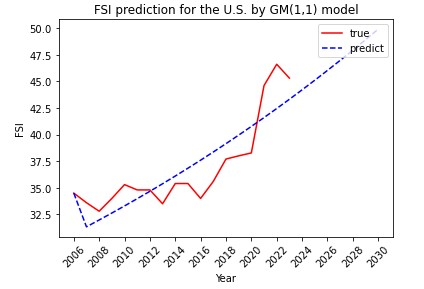
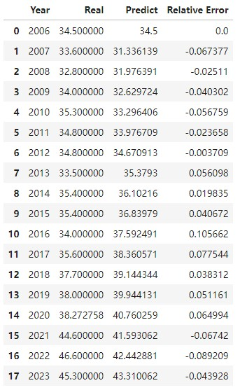

Nations' HP Evaluation
==================================

&emsp;&emsp;本项目旨在利用CGE模型推演经济体在执行策略后的经济收益，并与zz收益相结合，以期实现大国冲突模式下的血量评估。

****

|作者|wt|
|:---|:--:|
|更新日期|2024.3.13|

****
## 目录
* [血量评估函数](#血量评估函数)
* [经济利益指标](#经济利益指标)
    * 国家经济指标选取
    * 经济指标权重决定
* [zz利益指标](#zz利益指标)
    * 国家zz利益指标
    * 国家脆弱性指数预测 
    * 国家脆弱性指数变动 

### 血量评估函数
-------------
&emsp;&emsp;基于Cobb-Douglas函数形式，将国家效用定义为当期相对经济利益、预期相对经济利益、当期相对zz利益和预期相对zz利益四个部分不同权重（国家偏好）情况下的加总： 

$$
U_t = \left(\frac{C_t} {C_t^{ * }}\right) ^ {\alpha_1} 
\lbrace\frac{1}{N}\sum_{s=1}^N\rho_C^s\left[E_t\frac{C_{t+s}}{C_{t+s}^{ * }}\right]\rbrace^{\alpha_2}
\left(\frac{P_t} {P_t^{ * }}\right) ^ {\beta_1}
\lbrace\frac{1}{N}\sum_{s=1}^N\rho_P^s\left[E_t\frac{P_{t+s}}{P_{t+s}^{ * }}\right]\rbrace^{\beta_2}
$$

&emsp;&emsp;上式可简化为： 

$$
U_t = \left(\widetilde{C_t}\right)^{\alpha_1} \left(\widetilde{EC_t}\right)^{\alpha_2} \left(\widetilde{P_t}\right)^{\beta_1} \left(\widetilde{EP_t}\right)^{\beta_2}
$$

&emsp;&emsp;则在给定策略集合${\tau}$下的国家效用最大化可以表示为： 

$$
V_t = \mathop{Max}\limits_{\tau}U_t = \mathop{Max}\limits_{\tau}\left[\left(\widetilde{C_t}\right)^{\alpha_1}\left(\widetilde{EC_t}\right)^{\alpha_2}\left(\widetilde{P_t}\right)^{\beta_1}\left(\widetilde{EP_t}\right)^{\beta_2}\right]
$$

$$
h:\tau \rightarrow \{(\widetilde{C_t}),(\widetilde{EC_t}),(\widetilde{P_t}),(\widetilde{EP_t})\}
$$
 

### 经济利益指标
-------------

#### 国家经济指标选取

&emsp;&emsp;给定策略对经济利益指标的影响由CGE模型给出，初步确定为： 
|指标名称|单位|意义|
|:--:|:--:|:---|
|GDP|%变化|国民生产总值，是一个国家（地区）所有常住单位在一定时期内生产活动的最终成果，是国民经济的核心指标，也是衡量一个国家或地区经济状况和发展水平的重要指标。|
|社会福利|百万美元|CGE中的社会福利采用希克斯等价变差来表征，以政策实施前的商品价格为基础，测算居民在政策实施后的效用水平的变化情况。变动为正，说明居民福利在政策实施后得到改善，反之表示政策实施将损害居民福利。|
|贸易平衡|百万美元|衡量贸易逆差或顺差的大小。|
|进/出口额|%变化|进/出口额|

#### 经济指标权重决定

To Do

### zz利益指标
-------------
#### 国家zz利益指标

&emsp;&emsp;可考虑的指标有： 
&emsp;&emsp;社会动荡指数（Social Unrest Index，新版为Reported SUI）：月度数据，每6月一发布。由国际国币基金组织（IMF）研究人员根据相关媒体报道的数量提出。覆盖130个国家 — 经初步查找，仅公布了中东国家数据。 
&emsp;&emsp;国家脆弱性指数（Fragile Status Index）：年度数据，由一个叫和平基金（FFP）的NGO公布。包含178个国家，每个国家获得一个FSI评分，并根据国家面临的影响其脆弱程度的不同压力进行排名。 
&emsp;&emsp;国家全球jun力指数（Global Firepower Index）：年度数据。该指标来源于“全球火力网”，尽管其数据被部分网络媒体、研究学者引用，但在外网上，其可信度备受争议。该指标利用其独家计算公式，考虑60多种影响因子，将各国j事力量进行排名。在最新的2024年排名中，共有145个国家上榜。 
&emsp;&emsp;由于社会动荡指数缺乏中美等经济体的数据，全球jun力指数可信度存在质疑，因此选取国家脆弱指数作为zz利益的衡量指标。但国家脆弱性指数只公布了2006年-2023年的数据，因此需要对未来指标的变化进行预测。

#### 国家脆弱性指数预测-Baseline
&emsp;&emsp;国家脆弱性指数（FSI）为年度数据，包含160多个国家自2006年至2023年的数据。为了构建国家策略模拟的baseline，需要对FSI进行预测。本项目将预测2024年至2030年的策略影响效果。 
&emsp;&emsp;由于[原始可获得数据](FSIpred/oridata/)存在样本较少、信息不完备等特征，故使用灰色预测法对其进行预测，相关代码保存在[FSI_prediction](FSIpred/FSI_prediction.ipynb)中。 
&emsp;&emsp;GM(1,1)模型是一种...

&emsp;&emsp;**GM(1,1)模型原理**：
设有数列$X^{\left( 0 \right)} \left( k \right)$。。
设其一次累加生成数列为$X^{\left( 1 \right)}$ 
$$
X^{\left( 1 \right)} \left( k \right)=\sum^{k}_{i=1}X^{\left( 0 \right)} \left( k \right) \left( k=1,2,...n \right)
$$
&emsp;&emsp;对$X^{\left( 1 \right)}$建立一阶线性微分方程，即GM(1,1)模型： 
$$
\frac{dX^{\left( 1 \right)}}{dt}+aX^{\left( 1 \right)}=\mu
$$
&emsp;&emsp;解微分方程可以求得： 
$$
\hat{X}^{\left( 1 \right)} \left( k+1 \right)=\left[ X^{\left( 0 \right)} \left( 1 \right) - \frac{\mu}{a} \right] e^{-at} + \frac{\mu}{a}
$$
$$
\left( k=1,2,...,n-1 \right)
$$
&emsp;&emsp;由于GM(1,1)模型得到的是一次累加量，则将$\hat{X}^{\left( 1 \right)} \left( k+1 \right)$经过累减还原为： 
$$
\hat{X}^{\left( 0 \right)} \left( k+1 \right)=\left( e^{-\hat{a}} -1 \right) \left[ X^{\left( 0 \right)} \left( n \right) - \frac{\hat{\mu}}{\hat{a}} \right] e^{\hat{a}t}
$$
&emsp;&emsp;以美国为例，该国国家脆弱性指数的预测结果如下： 

 

 

&emsp;&emsp;该模型的检验结果如下： 

|指标|数值|
|:--:|:--:|
|MSE(Mean Square Error):|4.519503|
|RMSE(Root Mean Square Error):|2.125912|
|MAE(Mean Absolute Error):|1.823222|
|MRE(Mean Relative Error):|0.002045|
|R-Square:|0.652785|

#### 国家脆弱性指数变动-Policy Simulation
&emsp;&emsp;为了模拟政策的冲击效果对国家脆弱性指数的影响，考虑将国家脆弱性指数建模到CGE模型中。 

To Do

